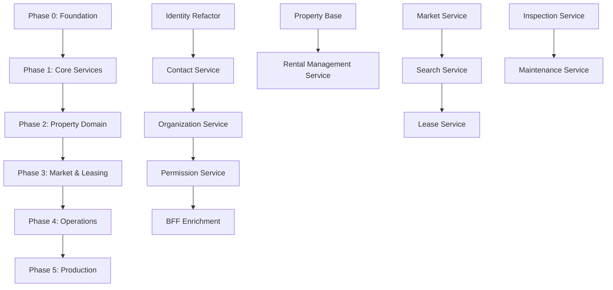

# Implementation Roadmap

**Version:** 1.1.0  
**Last Updated:** October 30, 2025  
**Status:** MVP 1 Planning - Updated

---

## Table of Contents

1. [Overview](#overview)
2. [Phase 0: Foundation (Current)](#phase-0-foundation-current)
3. [Phase 1: Core Services](#phase-1-core-services)
4. [Phase 2: Property Domain](#phase-2-property-domain)
5. [Phase 3: Market & Leasing](#phase-3-market--leasing)
6. [Phase 4: Operations](#phase-4-operations)
7. [Phase 5: Polish & Production](#phase-5-polish--production)
8. [Dependencies Graph](#dependencies-graph)
9. [Testing Strategy](#testing-strategy)
10. [Success Criteria](#success-criteria)

---

## Overview

This roadmap outlines the phased implementation of ProperTea MVP 1, prioritizing **educational value** and **functional
completeness** over time-to-market.

### Principles

- ✅ **Build vertically** - Complete one feature end-to-end before moving to next
- ✅ **Test continuously** - Integration tests after each phase
- ✅ **Document as you go** - Remove code samples from docs when implemented
- ✅ **Refactor early** - Address tech debt within each phase

### Timeline Estimate

| Phase       | Duration  | Services    | Deliverables                          |
|-------------|-----------|-------------|---------------------------------------|
| **Phase 0** | Completed | 2 services  | Identity, Landlord BFF (partial)      |
| **Phase 1** | 4 weeks   | 5 services  | Core auth & user management           |
| **Phase 2** | 3 weeks   | 2 services  | Property structure                    |
| **Phase 3** | 4 weeks   | 3 services  | Market & leasing                      |
| **Phase 4** | 3 weeks   | 3 services  | Operations (inspections, maintenance) |
| **Phase 5** | 2 weeks   | All         | Production deployment, monitoring     |
| **Total**   | ~16 weeks | 15 services | MVP 1 Complete                        |

---

## Phase 0: Foundation (Current)

**Status:** ✅ Completed (Partially - Needs Refactoring)

**What Exists:**

- Identity Service (basic auth, JWT generation, Google OAuth)
- Landlord BFF (session management, YARP routing)
- Shared libraries: ProperCqrs, ProperDdd, ProperIntegrationEvents, ProperTelemetry, ProperErrorHandling
- Docker-compose setup (infrastructure + services)
- Integration tests for Identity + BFF
- Local development workflow (Mode 1 & 2)

**What Needs Refactoring:**

- Identity Service → align with architecture (outbox pattern, workers)
- Landlord BFF → JWT enrichment, permission integration
- Shared libraries → add ProperSagas, ProperStorage

**Next Steps:**
→ Start Phase 1 (refactor existing + build Contact, Organization, Permission)

---

## Phase 1: Core Services

**Goal:** Complete authentication, authorization, and user management foundation.

**Duration:** 4 weeks

### Week 1: Refactoring & Shared Libraries

**Tasks:**

1. **Create ProperSagas Library**
    - `SagaBase` abstract class
    - `SagaStep` model
    - `SagaOrchestrator` base class
    - Unit tests

2. **Create ProperStorage Library**
    - `IBlobStorageService` interface
    - `AzuriteBlobStorageService` implementation (primary)
    - `SeaweedFSBlobStorageService` implementation (optional for Kind)
    - Configuration extensions

3. **Refactor Identity Service**
    - Move to separate API + Worker projects
    - Add outbox pattern for event publishing
    - Simplify registration endpoint (choreographed - no saga)
    - Update database schema (add outbox table)
    - Update endpoints to match spec
    - Integration tests for event flow

**Deliverables:**

- ✅ ProperSagas library with tests
- ✅ ProperStorage library with tests
- ✅ Identity Service refactored (API + Worker)
- ✅ User registration with choreographed events working

### Week 2: Contact & Organization Services

**Tasks:**

1. **Implement Contact Service**
    - Create solution structure (API + Worker + Domain)
    - `PersonalProfile` aggregate (organization-owned)
    - Database schema + migrations
        - **Key change:** `organization_id` column (contact owned by org)
        - Unique constraint: `(organization_id, user_id)`
    - CRUD endpoints
    - Worker: Listen to `UserCreated` (log for audit, no immediate action)
    - Integration tests

2. **Implement Organization Service**
    - `Organization` aggregate (with `OwnerUserId` field)
    - `Company` entity
    - `UserOrganization` entity
    - Database schema + migrations
    - CRUD endpoints for orgs, companies, membership
    - Publish `OrganizationCreated` event (choreographed)
    - Integration tests

**Deliverables:**

- ✅ Contact Service (API + Worker)
- ✅ Organization Service (API + Worker)
- ✅ Organization-owned contact model implemented
- ✅ Integration tests covering full flow

### Week 3: Permission Service

**Tasks:**

1. **Implement Permission Service**
    - `Group` aggregate
    - `PermissionDefinition` entity
    - Database schema + migrations
    - Endpoints: groups, permissions, authorization checks
    - Worker: Listen to `OrganizationCreated` → Seed default groups
    - Worker: Listen to `PermissionsRegistered` → Cache definitions
    - Permission caching strategy (Redis)
    - Integration tests

2. **Update Identity/Organization to Publish Permission Registrations**
    - Identity publishes permissions on startup
    - Organization publishes permissions on startup
    - Permission service receives and caches

**Deliverables:**

- ✅ Permission Service (API + Worker)
- ✅ Default groups seeded on org creation
- ✅ Permission definitions cached
- ✅ Integration tests

### Week 4: BFF Enhancement & Preferences

**Tasks:**

1. **Refactor Landlord BFF**
    - Implement on-demand JWT enrichment (lazy loading)
    - Update session structure (store JWT per org, populated on first access)
    - Add middleware: extract orgId from URL path
    - Add onboarding detection (redirect if no Contact)
    - Update session management
    - Integration tests

2. **Implement Preferences Service**
    - `UserPreference` entity (portal, org scoped)
    - Database schema + migrations
    - CRUD endpoints
    - Simple key-value storage
    - Integration tests

3. **End-to-End Testing**
    - User registration → profile creation → org creation → permissions
    - Multi-org user switching (on-demand JWT enrichment)
    - Onboarding flow

**Deliverables:**

- ✅ Landlord BFF with on-demand JWT enrichment and multi-org support
- ✅ Preferences Service
- ✅ Complete Phase 1: All core services working
- ✅ E2E tests for all authentication/authorization flows

---

## Phase 2: Property Domain

**Goal:** Implement property structure and rental object management.

**Duration:** 3 weeks

### Week 5-6: Property Base & Rental Management Services

**Tasks:**

1. **Implement Property Base Service**
    - `Property` aggregate
    - `Building` entity
    - `Room`, `Component` entities
    - Database schema + migrations
    - CRUD endpoints
    - Integration tests

2. **Implement Rental Management Service**
    - `RentalObject` aggregate
    - `VacancyPeriod` entity
    - Database schema + migrations
    - CRUD endpoints for rental objects
    - Availability calculation logic
    - Publish `PublicationRequested` event
    - Worker: Listen to `LeaseActivated`, `LeaseTerminated`
    - Integration tests

**Deliverables:**

- ✅ Property Base Service
- ✅ Rental Management Service
- ✅ Property structure management working
- ✅ Rental object availability calculations

### Week 7: Search Service Foundation

**Tasks:**

1. **Implement Search Service (Basic)**
    - Elasticsearch client setup
    - Index definitions (properties, rental objects, contacts)
    - Basic indexing API
    - Worker: Listen to domain events → Index in ES
    - Autocomplete endpoints
    - Integration tests

**Deliverables:**

- ✅ Search Service (API + Worker)
- ✅ Basic search functionality
- ✅ Autocomplete for properties, contacts

---

## Phase 3: Market & Leasing

**Goal:** Enable property listings, applications, and lease management.

**Duration:** 4 weeks

### Week 8-9: Market Service

**Tasks:**

1. **Implement Market Service**
    - `Listing` aggregate
    - `Application` aggregate
    - `Offer` entity
    - Database schema + migrations
    - CRUD endpoints
    - Worker: Listen to `VacancyPeriodCreated` → Create listing
    - Worker: Listen to `RentalObjectUpdated` → Update listing
    - Search integration (publish events for indexing)
    - Integration tests

**Deliverables:**

- ✅ Market Service (API + Worker)
- ✅ Listings automatically created from vacancies
- ✅ Application and offer workflows

### Week 10-11: Lease Service

**Tasks:**

1. **Implement Lease Service**
    - `Lease` aggregate
    - Approval workflow
    - Digital signature integration (placeholder)
    - Database schema + migrations
    - CRUD endpoints
    - Worker: Listen to `OfferAccepted` → Create lease
    - Publish `LeaseActivated`, `LeaseTerminated` events
    - Integration tests

**Deliverables:**

- ✅ Lease Service (API + Worker)
- ✅ Full leasing workflow: listing → application → offer → lease
- ✅ Lease activation/termination triggers vacancy updates

---

## Phase 4: Operations

**Goal:** Handle inspections and maintenance.

**Duration:** 3 weeks

### Week 12: Dwelling Inspection Service

**Tasks:**

1. **Implement Dwelling Inspection Service**
    - `DwellingInspection` aggregate
    - Database schema + migrations
    - CRUD endpoints
    - Worker: Listen to `LeaseTerminated` → Create inspection
    - Assign to inspector logic
    - Integration tests

**Deliverables:**

- ✅ Dwelling Inspection Service (API + Worker)
- ✅ Automatic inspection creation on lease termination

### Week 13: Maintenance Service

**Tasks:**

1. **Implement Maintenance Service**
    - `FaultNotification` aggregate
    - `WorkOrder` aggregate
    - Database schema + migrations
    - CRUD endpoints
    - Work order assignment
    - Integration tests

**Deliverables:**

- ✅ Maintenance Service (API + Worker)
- ✅ Fault reporting and work order management

### Week 14: Additional BFFs

**Tasks:**

1. **Implement Tenant BFF**
    - Session management
    - User-scoped routing (no org enrichment)
    - Integration tests

2. **Implement Market BFF**
    - Session management
    - Public + user-scoped routing
    - Integration tests

**Deliverables:**

- ✅ Tenant BFF
- ✅ Market BFF
- ✅ All 3 portals operational

---

## Phase 5: Polish & Production

**Goal:** Production-ready deployment, monitoring, and polish.

**Duration:** 2 weeks

### Week 15: Production Deployment

**Tasks:**

1. **Azure AKS Deployment**
    - Create Bicep templates for all services
    - Set up managed services (Postgres, Redis, ServiceBus, Blob)
    - Configure Key Vault for secrets
    - Deploy to ACA environment
    - Smoke tests in production

2. **Observability Enhancement**
    - Configure Azure Monitor / Application Insights
    - Set up dashboards in Azure Monitor
    - Configure alerts (error rate, latency, availability)

**Deliverables:**

- ✅ All services deployed to ACA
- ✅ Observability configured
- ✅ Smoke tests passing

### Week 16: Testing & Documentation

**Tasks:**

1. **Comprehensive Testing**
    - Review all integration tests
    - Add missing test scenarios
    - Performance testing (load test critical endpoints)
    - Security testing (penetration testing, OWASP Top 10)

2. **Documentation Cleanup**
    - Remove all code samples from docs (now implemented)
    - Update diagrams with actual deployed architecture
    - Create user guides for each portal

3. **Developer Experience**
    - Finalize Makefile commands
    - Document troubleshooting common issues
    - Create onboarding guide for new developers

**Deliverables:**

- ✅ Full test coverage
- ✅ Documentation complete and accurate
- ✅ Developer onboarding guide

**Phase 5 Success Criteria:**

- [ ] MVP 1 deployed to production (ACA)
- [ ] All services monitored with alerts
- [ ] 90%+ integration test coverage
- [ ] Documentation reflects implemented system
- [ ] New developer can onboard in 1 day

---

## Dependencies Graph

**Critical Path:**

1. Identity → Contact → Organization → Permission (must be sequential)
2. Property Base → Vacancy (Vacancy depends on Property events)
3. Vacancy → Market → Lease (Market depends on Vacancy, Lease depends on Market)
4. Lease → Inspection (Inspection depends on Lease termination events)

**Can Be Parallel:**

- Preferences service (independent, can be built anytime in Phase 1)
- Search service (can start early, just won't have data to index until Market exists)
- Maintenance service (independent of Inspection, can be parallel)
- Tenant BFF + Market BFF (independent of each other)

---

## Testing Strategy

### Unit Tests

- **Every shared library:** ProperCqrs, ProperDdd, ProperSagas, etc.
- **Every domain aggregate:** Test business logic
- **Coverage target:** 80%+

### Integration Tests

- **After each service:** Test service endpoints + database
- **After each phase:** Test cross-service flows
- **Test environment:** Docker Compose (Mode 3)
- **Coverage target:** 90%+ for critical flows

### End-to-End Tests

- **After Phase 3:** Full user journeys (registration → property creation → listing → lease)
- **Test environment:** Kind cluster (Mode 4)
- **Coverage target:** Happy path + critical error scenarios

### Performance Tests

- **Phase 5:** Load testing for:
    - Authentication endpoints (1000 req/s)
    - Search endpoints (500 req/s)
    - CRUD endpoints (200 req/s)
- **Tool:** k6 or Apache JMeter

---

## Success Criteria

### MVP 1 Complete When:

**Functional:**

- [ ] User can register, login across all 3 portals
- [ ] Landlord can create property structure, publish listings
- [ ] Market user can search, apply, accept offer
- [ ] Lease created and activated from offer
- [ ] Tenant can view lease, report faults
- [ ] Lease termination triggers inspection + new vacancy
- [ ] All permissions enforced correctly

**Technical:**

- [ ] All 15 services deployed to ACA
- [ ] Integration tests passing (90%+ coverage)
- [ ] Observability configured (traces, metrics, logs, dashboards)
- [ ] Documentation complete (no code samples, accurate diagrams)
- [ ] Local development works (all 4 modes)
- [ ] No critical bugs in production

**Educational:**

- [ ] Custom CQRS, DDD, Saga patterns implemented and tested
- [ ] Event-driven flows working (choreography + orchestration)
- [ ] Kubernetes deployment understood (Helm charts, Kind)
- [ ] Observability stack mastered (OTel, Jaeger, Prometheus, Grafana)

---

## Post-MVP 1 (MVP 2 Scope)

**Not included in MVP 1, but planned:**

- Invoicing Service (rent invoices, payment tracking)
- Accounting Service (financial reports, ledger)
- Notification Service (email, SMS, push notifications)
- Document Management (lease PDFs, digital signatures via DocuSign)
- Advanced Search (saved queries, favorite views)
- Mobile Apps (iOS, Android)
- Advanced Authorization (attribute-based access control)
- Multi-language Support
- Advanced Analytics & Reporting

---

**Document Version:**

| Version | Date       | Changes                                  |
|---------|------------|------------------------------------------|
| 1.0.0   | 2025-10-22 | Initial implementation roadmap for MVP 1 |

