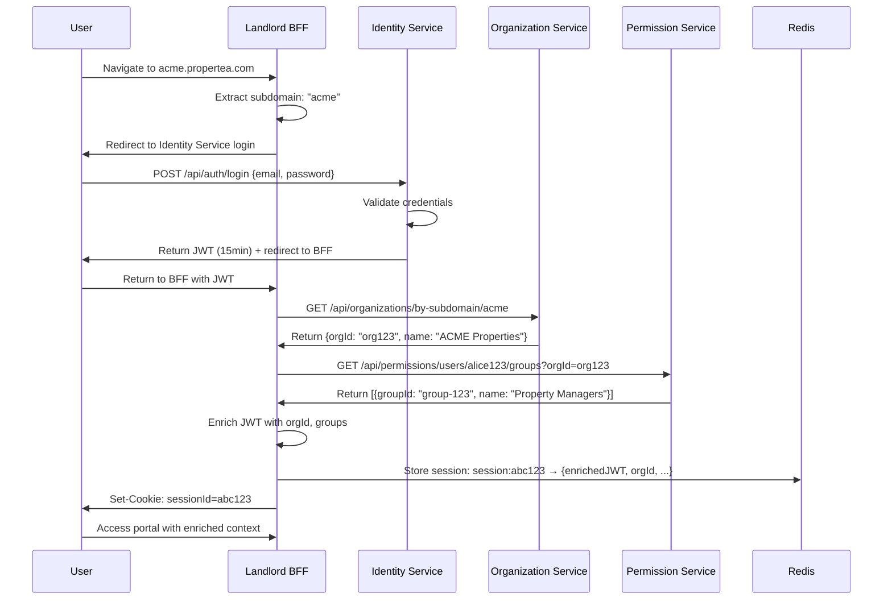
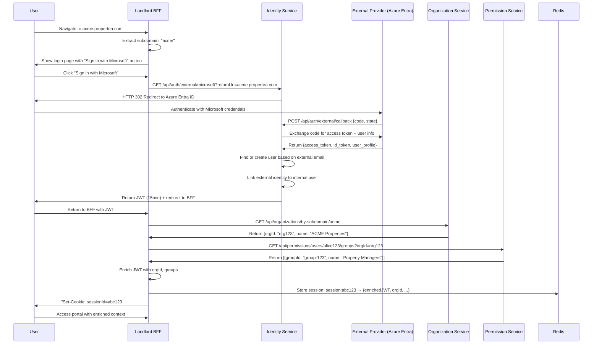
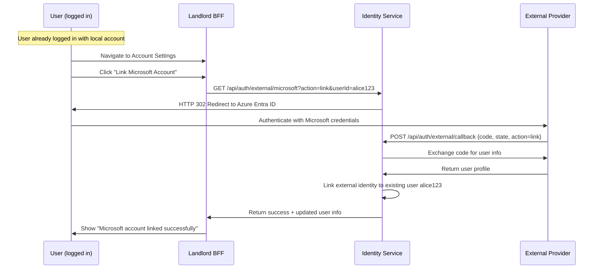
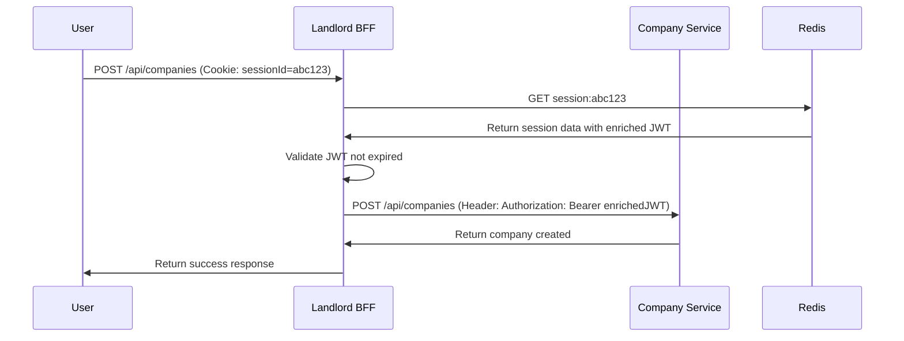
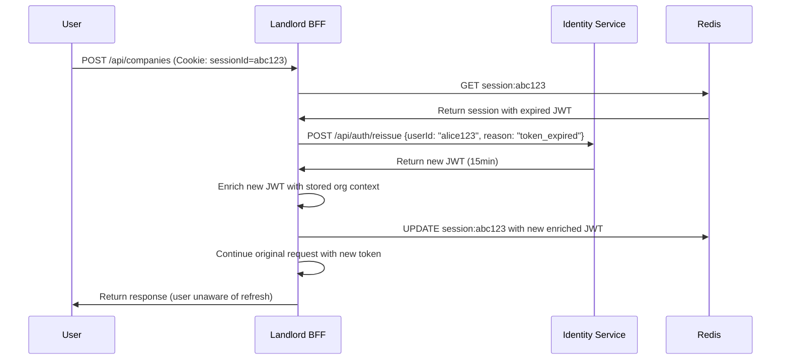
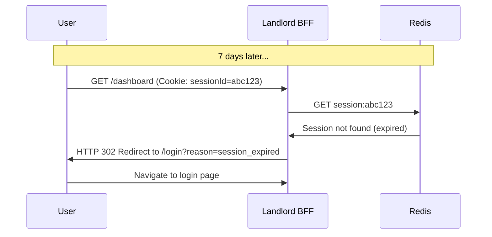
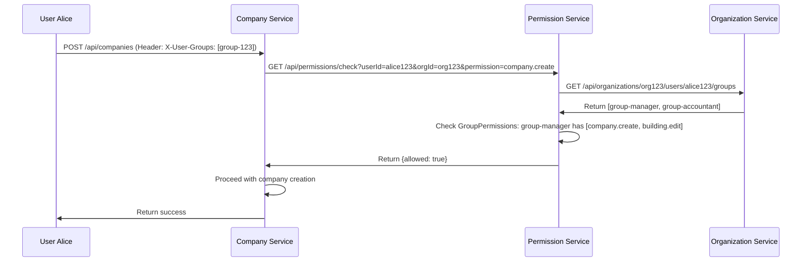

# Authentication & Authorization Strategy - ProperTea MVP 1

## Table of Contents
1. [Executive Summary](#executive-summary)
2. [Architecture Overview](#architecture-overview)
3. [Service Responsibilities](#service-responsibilities)
4. [Authentication Flow](#authentication-flow)
5. [Authorization Architecture](#authorization-architecture)
6. [BFF Layer (Gateway)](#bff-layer-gateway)
7. [Session Management](#session-management)
8. [Cookie Security](#cookie-security)
9. [Database Schemas](#database-schemas)
10. [API Specifications](#api-specifications)
11. [Security Considerations](#security-considerations)
12. [Implementation Roadmap](#implementation-roadmap)

---

## Executive Summary

ProperTea implements a **session-based authentication** system with **distributed authorization** across multiple BFFs (Backend for Frontend) serving different portals. The architecture prioritizes security through HTTP-only cookies, Redis-backed sessions, and fine-grained permissions managed by a dedicated PermissionService.

### Key Architectural Decisions
- **Session-based authentication** (no refresh tokens needed)
- **Separate BFFs** for each portal (Landlord, Tenant, Market, Support)
- **PermissionService** manages user groups and authorization
- **Event-driven choreography** for organization creation and default group seeding
- **Redis sessions** with HTTP-only cookies for maximum security

### Service Architecture
```
┌─────────────────┐   ┌─────────────────┐   ┌─────────────────┐
│ Landlord Portal │   │ Tenant Portal   │   │ Market Portal   │
│ (React/Blazor)  │   │ (React/Blazor)  │   │ (React/Blazor)  │
└─────────┬───────┘   └─────────┬───────┘   └─────────┬───────┘
          │                     │                     │
┌─────────▼───────┐   ┌─────────▼───────┐   ┌─────────▼───────┐
│ Landlord BFF    │   │ Tenant BFF      │   │ Market BFF      │
│ (ASP.NET Core)  │   │ (ASP.NET Core)  │   │ (ASP.NET Core)  │
└─────────┬───────┘   └─────────┬───────┘   └─────────┬───────┘
          │                     │                     │
          └─────────────────────┼─────────────────────┘
                                │
        ┌───────────────────────┼───────────────────────┐
        │                       │                       │
┌───────▼─────┐   ┌─────────▼─────────┐   ┌─────────▼─────────┐
│ Identity    │   │ Permission        │   │ Organization      │
│ Service     │   │ Service           │   │ Service           │
└─────────────┘   └───────────────────┘   └───────────────────┘
```

---

## Architecture Overview

### Core Principles
1. **Security First**: HTTP-only cookies, short-lived tokens, secure session management
2. **Microservice Independence**: Each service owns its domain and permissions
3. **Scalability**: Redis-backed sessions, stateless services, horizontal scaling
4. **User Experience**: Seamless token refresh, multi-device support, portal-specific preferences
5. **Educational Value**: Demonstrates microservice patterns, event-driven architecture, security best practices

### Technology Stack
- **BFF Framework**: ASP.NET Core with YARP for reverse proxy
- **Session Store**: Redis (sessions, permissions cache, user preferences)
- **Message Bus**: Azure Service Bus or RabbitMQ (for event choreography)
- **Database**: PostgreSQL (for all services)
- **Load Balancer**: Azure Container Apps with Ocelot Gateway

---

## Service Responsibilities

### Identity Service
**Purpose**: Authentication broker and JWT token management

**Responsibilities**:
- User authentication (username/password, MFA)
- **External identity provider integration** (Azure Entra ID, Google, Microsoft)
- **Identity linking and mapping** (external identities → internal users)
- JWT token issuance and reissuance
- Password reset workflows (for local accounts)
- User account lifecycle (create, activate, deactivate)

**Key Endpoints**:
- `POST /api/auth/login` - Local user authentication
- **`GET /api/auth/external/{provider}` - Initiate external provider login**
- **`POST /api/auth/external/callback` - Handle external provider callback**
- **`POST /api/auth/link-external` - Link external identity to existing user**
- `POST /api/auth/reissue` - Token reissuance for BFFs
- `POST /api/auth/logout` - Invalidate user sessions
- `POST /api/auth/reset-password` - Password reset flow (local accounts only)

**Database Tables**:
- `Users`: Core user identity data
- **`ExternalLogins`: External identity provider mappings**
- `UserLogins`: External login providers (Google, Microsoft) **[DEPRECATED - use ExternalLogins]**
- `UserClaims`: Additional user claims
- `SecurityLogs`: Authentication attempts and security events

### Organization Service
**Purpose**: Organizational structure and user-organization relationships

**Responsibilities**:
- Organization CRUD operations
- User-organization relationship management
- Organization approval workflow (new org → pending → approved)
- Publishing events for organization lifecycle

**Key Endpoints**:
- `POST /api/organizations` - Create new organization
- `GET /api/organizations/{orgId}/users` - List organization members
- `POST /api/organizations/{orgId}/users/{userId}` - Add user to organization
- `GET /api/organizations/by-subdomain/{subdomain}` - Resolve org from subdomain

**Database Tables**:
- `Organizations`: Organization master data
- `UserOrganizations`: User membership in organizations
- `OrganizationSettings`: Configuration per organization

**Events Published**:
- `OrganizationCreated`: Triggers default group seeding
- `UserAddedToOrganization`: Triggers welcome email, audit logging

### Permission Service
**Purpose**: Authorization, user groups, and permission management

**Responsibilities**:
- User group management (CRUD, membership)
- Permission definition caching (from domain services)
- Group-permission assignments
- Authorization checks for all services
- Default group seeding (event handler)

**Key Endpoints**:
- `GET /api/permissions/definitions/all` - All available permissions
- `POST /api/permissions/definitions/refresh` - Force refresh from services
- `GET /api/permissions/groups?orgId={orgId}` - List groups in organization
- `POST /api/permissions/groups` - Create user group
- `POST /api/permissions/groups/{groupId}/assignments` - Assign permissions to group
- `POST /api/permissions/groups/{groupId}/members` - Add users to group
- `GET /api/permissions/check?userId={}&orgId={}&permission={}` - Authorization check

**Database Tables**:
- `Groups`: User groups scoped by organization
- `GroupMembers`: User membership in groups
- `GroupPermissions`: Permission assignments to groups
- `PermissionCache`: Cached permission definitions from services (Redis)

**Events Subscribed**:
- `OrganizationCreated`: Seeds default groups with recommended permissions

### BFF Services (Landlord, Tenant, Market, Support)
**Purpose**: Portal-specific gateway, session management, and request aggregation

**Responsibilities**:
- JWT enrichment (subdomain → org context → user groups)
- Session management (Redis-backed with HTTP-only cookies)
- Request routing and aggregation
- User preference management (portal-specific UI settings)
- Authentication middleware (token validation and refresh)

**Session Structure**:
```json
{
  "sessionId": "abc123",
  "userId": "alice123",
  "orgId": "org123",
  "orgRole": "Admin",
  "enrichedJwt": "eyJhbGc...",
  "createdAt": "2024-01-15T10:00:00Z",
  "lastRefreshedAt": "2024-01-15T12:30:00Z",
  "deviceInfo": {
    "userAgent": "Mozilla/5.0...",
    "ipAddress": "192.168.1.1"
  }
}
```

### Domain Services (Company, Lease, Contact, etc.)
**Purpose**: Business logic and domain-specific operations

**Responsibilities**:
- Domain business logic
- Expose permission metadata endpoints
- Query PermissionService for authorization
- Data persistence and validation

**Standard Endpoints**:
- `GET /api/permissions/metadata` - Service-owned permission definitions
- `GET /api/permissions/default-groups` - Recommended group-permission mappings

---

## Authentication Flow

### 1. Initial User Login



### 1b. External Provider Login (Azure Entra ID / Google)



### 1c. Account Linking (Existing User Links External Identity)



### 2. Subsequent Request (Token Valid)



### 3. Token Refresh (Transparent to User)



### 4. Session Expiration



---

## Authorization Architecture

### Permission Model

**Two-Level Authorization**:
1. **Organization/Company Level**: Handled by PermissionService (cached, cross-service)
2. **Resource-Specific Level**: Handled by individual domain services

### Permission Definitions (Service-Owned)

Each service defines its own permissions:

```json
// Company Service - permissions.json
[
  {
    "id": "company.create",
    "displayName": "Create Company",
    "description": "Allows creating new companies in the system",
    "category": "Company Management"
  },
  {
    "id": "building.edit",
    "displayName": "Edit Building",
    "description": "Allows modifying building details",
    "category": "Building Management"
  }
]
```

### Default Group Seeding

When a new organization is created, services provide default group recommendations:

```json
// Company Service - GET /api/permissions/default-groups
[
  {
    "groupName": "Property Managers",
    "permissions": ["company.edit", "building.edit", "apartment.edit"]
  },
  {
    "groupName": "Maintenance Personnel", 
    "permissions": ["apartment.view", "maintenance.create"]
  }
]
```

### Authorization Flow



---

## BFF Layer (Gateway)

### JWT Enrichment Process

The BFF enriches the base JWT from Identity Service with organization-specific context:

```csharp
public async Task<string> EnrichTokenAsync(string baseJwt, string subdomain)
{
    var handler = new JwtSecurityTokenHandler();
    var baseToken = handler.ReadJwtToken(baseJwt);
    var userId = baseToken.Subject;

    // 1. Resolve organization from subdomain
    var organization = await _organizationService.GetBySubdomainAsync(subdomain);
    
    // 2. Get user's groups in this organization
    var userGroups = await _permissionService.GetUserGroupsAsync(userId, organization.Id);

    // 3. Get user profile information from the Contact Service (with caching)
    // This data is considered PII and is not stored in the Identity Service.
    var userProfile = await _contactService.GetUserProfileAsync(userId); // Implement with caching
    
    // 4. Create enriched claims
    var enrichedClaims = new List<Claim>
    {
        new("sub", userId),
        new("name", userProfile.DisplayName ?? string.Empty), // From Contact Service
        new("email", baseToken.Claims.First(c => c.Type == "email").Value),
        new("orgId", organization.Id.ToString()),
        new("orgName", organization.Name),
        new("orgRole", await GetUserOrgRoleAsync(userId, organization.Id))
    };
    
    // Add group claims
    foreach (var group in userGroups)
    {
        enrichedClaims.Add(new("groups", group.Id));
        enrichedClaims.Add(new("groupNames", group.Name));
    }
    
    // 5. Generate new JWT with enriched claims
    var enrichedToken = _jwtService.GenerateToken(enrichedClaims, TimeSpan.FromMinutes(15));
    
    return enrichedToken;
}
```

### Middleware Pipeline

```csharp
public class BffMiddlewarePipeline
{
    public void Configure(IApplicationBuilder app)
    {
        app.UseRouting();
        
        // 1. CORS and security headers
        app.UseCors();
        app.UseSecurityHeaders();
        
        // 2. Session management (validates and refreshes tokens)
        app.UseMiddleware<SessionManagementMiddleware>();
        
        // 3. Request logging and telemetry
        app.UseMiddleware<RequestLoggingMiddleware>();
        
        // 4. Route to controllers or proxy to backend services
        app.UseEndpoints(endpoints =>
        {
            endpoints.MapControllers(); // BFF-specific endpoints
            endpoints.MapReverseProxy(); // Proxy to backend services
        });
    }
}
```

---

## Session Management

### Redis Session Structure

```json
{
  "sessionId": "abc123",
  "userId": "alice123",
  "orgId": "org123", 
  "orgRole": "Admin",
  "enrichedJwt": "eyJhbGc...",
  "createdAt": "2024-01-15T10:00:00Z",
  "lastRefreshedAt": "2024-01-15T12:30:00Z",
  "lastActivityAt": "2024-01-15T14:45:00Z",
  "deviceInfo": {
    "userAgent": "Mozilla/5.0 (Windows NT 10.0; Win64; x64) AppleWebKit/537.36",
    "ipAddress": "192.168.1.10",
    "fingerprint": "sha256:abc123..."
  },
  "preferences": {
    "theme": "dark",
    "language": "en",
    "dashboardLayout": "compact"
  }
}
```

### Session Lifecycle

**Creation**:
- User authenticates → BFF creates session in Redis with 7-day TTL
- Session ID stored in HTTP-only cookie

**Maintenance**:
- Every request → BFF extends session TTL (sliding expiration disabled for MVP 1)
- Token expiring in <2 minutes → BFF proactively refreshes from Identity Service

**Termination**:
- User logout → BFF deletes Redis session + clears cookie
- Session TTL expires → automatic cleanup
- Admin revocation → BFF deletes specific session(s)

### Multi-Device Support

Each device gets a separate session:

```
Redis Keys for user alice123:
- session:abc123 → Chrome on Windows
- session:xyz789 → Safari on iPhone  
- session:def456 → Firefox on Linux

User tracking:
- user:alice123:sessions → [abc123, xyz789, def456]
```

**Admin can revoke individual sessions**:
```csharp
public async Task RevokeSessionAsync(string userId, string sessionId)
{
    // Remove from user's session list
    await _cache.SetRemoveAsync($"user:{userId}:sessions", sessionId);
    
    // Delete the session
    await _cache.RemoveAsync($"session:{sessionId}");
    
    _logger.LogInformation("Revoked session {SessionId} for user {UserId}", sessionId, userId);
}
```

---

## Cookie Security

### Complete Cookie Configuration

```csharp
public static CookieOptions SecureSessionCookie => new()
{
    HttpOnly = true,           // Prevents JavaScript access (XSS protection)
    Secure = true,             // HTTPS only (prevents network sniffing)
    SameSite = SameSiteMode.Strict, // CSRF protection
    Path = "/",                // Available for entire domain
    MaxAge = TimeSpan.FromDays(7), // Cookie expires in 7 days
    IsEssential = true         // GDPR compliance (necessary for auth)
};
```

### Cookie Security Headers

```csharp
public class SecurityHeadersMiddleware
{
    public async Task InvokeAsync(HttpContext context, RequestDelegate next)
    {
        // Security headers
        context.Response.Headers.Add("X-Content-Type-Options", "nosniff");
        context.Response.Headers.Add("X-Frame-Options", "DENY");
        context.Response.Headers.Add("X-XSS-Protection", "1; mode=block");
        context.Response.Headers.Add("Referrer-Policy", "strict-origin-when-cross-origin");
        
        // Content Security Policy
        context.Response.Headers.Add("Content-Security-Policy", 
            "default-src 'self'; " +
            "script-src 'self' 'unsafe-inline'; " +
            "style-src 'self' 'unsafe-inline'; " +
            "img-src 'self' data: https:; " +
            "connect-src 'self'; " +
            "frame-ancestors 'none'");
        
        await next(context);
    }
}
```

### Advanced Cookie Security (Optional)

```csharp
// Use __Host- prefix for maximum security
var cookieName = "__Host-sessionId";

// Cookie with integrity checking
public class IntegrityProtectedCookie
{
    public string SessionId { get; set; }
    public string Signature { get; set; } // HMAC of sessionId + secret
}

// Validate cookie integrity
public bool ValidateCookieIntegrity(string cookieValue)
{
    var cookie = JsonSerializer.Deserialize<IntegrityProtectedCookie>(cookieValue);
    var expectedSignature = GenerateHmac(cookie.SessionId, _cookieSecret);
    return cookie.Signature == expectedSignature;
}
```

---

## Database Schemas

### Identity Service

```sql
-- ASP.NET Core Identity tables (auto-generated by framework)
-- AspNetUsers: Core user identity (replaces custom Users table)
-- AspNetUserClaims: User claims
-- AspNetUserLogins: External provider logins (replaces custom ExternalLogins)
-- AspNetUserTokens: Provider tokens and verification tokens
-- AspNetRoles: Roles (if using role-based features)
-- AspNetUserRoles: User role assignments

-- Security audit logs (custom)
CREATE TABLE SecurityLogs (
    Id UUID PRIMARY KEY DEFAULT gen_random_uuid(),
    UserId UUID REFERENCES AspNetUsers(Id),
    Event VARCHAR(100) NOT NULL,
    IpAddress INET,
    UserAgent TEXT,
    Details JSONB,
    CreatedAt TIMESTAMPTZ DEFAULT NOW()
);

-- Indexes for custom tables
CREATE INDEX idx_security_logs_user_event ON SecurityLogs(UserId, Event);
CREATE INDEX idx_security_logs_created_at ON SecurityLogs(CreatedAt);
```

### Organization Service

```sql
-- Organizations table
CREATE TABLE Organizations (
    Id UUID PRIMARY KEY DEFAULT gen_random_uuid(),
    Name VARCHAR(200) NOT NULL,
    Subdomain VARCHAR(50) UNIQUE NOT NULL,
    Status VARCHAR(20) DEFAULT 'pending', -- 'pending', 'approved', 'suspended'
    Plan VARCHAR(20) DEFAULT 'free', -- 'free', 'professional', 'enterprise'
    CreatedAt TIMESTAMPTZ DEFAULT NOW(),
    UpdatedAt TIMESTAMPTZ DEFAULT NOW()
);

-- User-Organization relationships
CREATE TABLE UserOrganizations (
    Id UUID PRIMARY KEY DEFAULT gen_random_uuid(),
    UserId UUID NOT NULL, -- Changed to UUID
    OrganizationId UUID REFERENCES Organizations(Id) ON DELETE CASCADE,
    Role VARCHAR(20) DEFAULT 'member', -- 'owner', 'admin', 'member'
    InvitedAt TIMESTAMPTZ,
    JoinedAt TIMESTAMPTZ,
    CreatedAt TIMESTAMPTZ DEFAULT NOW(),
    UNIQUE(UserId, OrganizationId)
);

-- Indexes
CREATE INDEX idx_organizations_subdomain ON Organizations(Subdomain);
CREATE INDEX idx_user_orgs_user ON UserOrganizations(UserId);
CREATE INDEX idx_user_orgs_org ON UserOrganizations(OrganizationId);
```

### Permission Service

```sql
-- User groups
CREATE TABLE Groups (
    Id UUID PRIMARY KEY DEFAULT gen_random_uuid(),
    OrganizationId UUID NOT NULL,
    Name VARCHAR(100) NOT NULL,
    Description TEXT,
    IsDefault BOOLEAN DEFAULT FALSE,
    CreatedAt TIMESTAMPTZ DEFAULT NOW(),
    UpdatedAt TIMESTAMPTZ DEFAULT NOW(),
    UNIQUE(OrganizationId, Name)
);

-- Group memberships
CREATE TABLE GroupMembers (
    Id UUID PRIMARY KEY DEFAULT gen_random_uuid(),
    GroupId UUID REFERENCES Groups(Id) ON DELETE CASCADE,
    UserId UUID NOT NULL, -- Changed to UUID
    AddedAt TIMESTAMPTZ DEFAULT NOW(),
    UNIQUE(GroupId, UserId)
);

-- Group permissions
CREATE TABLE GroupPermissions (
    Id UUID PRIMARY KEY DEFAULT gen_random_uuid(),
    GroupId UUID REFERENCES Groups(Id) ON DELETE CASCADE,
    PermissionId VARCHAR(100) NOT NULL, -- e.g., 'company.create'
    AssignedAt TIMESTAMPTZ DEFAULT NOW(),
    UNIQUE(GroupId, PermissionId)
);

-- Indexes
CREATE INDEX idx_groups_org ON Groups(OrganizationId);
CREATE INDEX idx_group_members_group ON GroupMembers(GroupId);
CREATE INDEX idx_group_members_user ON GroupMembers(UserId);
CREATE INDEX idx_group_permissions_group ON GroupPermissions(GroupId);
CREATE INDEX idx_group_permissions_permission ON GroupPermissions(PermissionId);
```

---

## API Specifications

### Identity Service

#### POST /api/auth/login
```json
// Request
{
  "email": "alice@acme.com",
  "password": "SecurePassword123!",
  "rememberMe": false
}

// Response 200 OK
{
  "accessToken": "eyJhbGc...",
  "expiresIn": 900,
  "user": {
    "id": "d3b4a8a0-9b7c-4c1d-aa1c-0a9a9a9a9a9a",
    "email": "alice@acme.com"
  }
}

// Response 401 Unauthorized
{
  "error": "invalid_credentials",
  "message": "Invalid email or password"
}
```

#### POST /api/auth/reissue
```json
// Request (from BFF only)
{
  "expiredToken": "eyJhbGciOiJIUzI1NiIsInR5cCI6IkpXVCJ9..."
}

// Response 200 OK
{
  "accessToken": "eyJhbGc...",
  "expiresIn": 900
}

// Response 401 Unauthorized
{
  "error": "user_inactive",
  "message": "User account is disabled"
}
```

#### GET /api/auth/external/{provider}
```http
GET /api/auth/external/google

// Response 302 Found
Location: https://accounts.google.com/o/oauth2/v2/auth?response_type=code&client_id=...&redirect_uri=...&scope=openid%20email%20profile

// Response 400 Bad Request (invalid provider)
{
  "error": "invalid_provider",
  "message": "The specified provider is not supported"
}
```

#### POST /api/auth/external/callback
```json
// Request (from external provider)
{
  "code": "authorization_code_from_provider",
  "state": "random_state_string"
}

// Response 200 OK
{
  "accessToken": "eyJhbGc...",
  "expiresIn": 900,
  "user": {
    "id": "d3b4a8a0-9b7c-4c1d-aa1c-0a9a9a9a9a9a",
    "email": "alice@acme.com",
    "externalId": "google|1234567890"
  }
}

// Response 401 Unauthorized
{
  "error": "invalid_grant",
  "message": "Invalid authorization code"
}
```

#### POST /api/auth/link-external
```json
// Request
{
  "provider": "Google",
  "idToken": "eyJhbGc...",
  "userId": "d3b4a8a0-9b7c-4c1d-aa1c-0a9a9a9a9a9a"
}

// Response 200 OK
{
  "message": "External identity linked successfully"
}

// Response 400 Bad Request
{
  "error": "linking_failed",
  "message": "Failed to link external identity"
}
```

### Permission Service

#### GET /api/permissions/check
```http
GET /api/permissions/check?userId=alice123&orgId=org123&permission=company.create

// Response 200 OK
{
  "allowed": true,
  "reason": "User is member of group 'Property Managers' which has permission 'company.create'"
}

// Response 200 OK (denied)
{
  "allowed": false,
  "reason": "User has no groups with permission 'company.create'"
}
```

#### POST /api/permissions/groups/{groupId}/assignments
```json
// Request
{
  "permissions": [
    "company.create",
    "company.edit",
    "building.edit"
  ]
}

// Response 200 OK
{
  "assigned": [
    "company.create",
    "company.edit", 
    "building.edit"
  ],
  "failed": []
}

// Response 400 Bad Request
{
  "error": "invalid_permissions",
  "failed": ["nonexistent.permission"],
  "message": "Some permissions do not exist"
}
```

### Organization Service

#### GET /api/organizations/by-subdomain/{subdomain}
```http
GET /api/organizations/by-subdomain/acme

// Response 200 OK
{
  "id": "org123",
  "name": "ACME Properties",
  "subdomain": "acme",
  "status": "approved",
  "plan": "professional"
}

// Response 404 Not Found
{
  "error": "organization_not_found",
  "message": "No organization found for subdomain 'acme'"
}
```

---

## Security Considerations

### Authentication Security

1. **Password Security**:
   - Minimum 8 characters, complexity requirements
   - BCrypt hashing with salt (cost factor 12+)
   - Account lockout after 5 failed attempts (30-minute lockout)

2. **Session Security**:
   - HTTP-only cookies with Secure and SameSite flags
   - Session rotation on privilege escalation
   - Device fingerprinting for session validation

3. **Token Security**:
   - Short-lived access tokens (15 minutes)
   - No refresh tokens (session-based architecture)
   - JWT signature validation on every request

### Authorization Security

1. **Permission Validation**:
   - All permissions validated against cached definitions
   - Resource-level authorization in domain services
   - Audit logging for all permission checks

2. **Group Management**:
   - Only organization admins can modify groups
   - Default groups provide sensible permission baselines
   - Permission assignments logged for audit

### Network Security

1. **TLS/HTTPS**:
   - TLS 1.3 minimum
   - HTTP Strict Transport Security (HSTS)
   - Certificate pinning for service-to-service communication

2. **CORS Configuration**:
   ```csharp
   services.AddCors(options =>
   {
       options.AddDefaultPolicy(builder =>
       {
           builder
               .WithOrigins("https://landlord.propertea.com", "https://tenant.propertea.com")
               .AllowCredentials()
               .AllowAnyMethod()
               .AllowAnyHeader();
       });
   });
   ```

3. **Rate Limiting**:
   - Authentication endpoints: 5 requests/minute per IP
   - API endpoints: 100 requests/minute per user
   - Admin endpoints: 10 requests/minute per user

### Data Protection

1. **GDPR Compliance**:
   - Separate Contact Service for PII
   - Right to be forgotten implementation
   - Data processing audit logs

2. **Encryption**:
   - Data at rest: PostgreSQL TDE
   - Data in transit: TLS 1.3
   - Application secrets: Azure Key Vault

---

## Implementation Roadmap

### Phase 1: Core Authentication (Weeks 1-2)
- [ ] Identity Service implementation
- [ ] Basic JWT token issuance and validation
- [ ] User registration and login flows
- [ ] Password reset functionality

### Phase 2: Session Management (Weeks 3-4)
- [ ] BFF session middleware implementation
- [ ] Redis session store configuration
- [ ] Secure cookie implementation
- [ ] Token refresh automation

### Phase 3: Authorization Foundation (Weeks 5-6)
- [ ] Permission Service implementation
- [ ] Organization Service implementation
- [ ] Basic group and permission management
- [ ] Event-driven organization creation

### Phase 4: BFF Integration (Weeks 7-8)
- [ ] JWT enrichment logic
- [ ] Subdomain-to-organization resolution
- [ ] Multi-device session support
- [ ] User preference management

### Phase 5: Portal Implementation (Weeks 9-12)
- [ ] Landlord BFF and portal
- [ ] Tenant BFF and portal
- [ ] Market BFF and portal
- [ ] Default group seeding

### Phase 6: Security Hardening (Weeks 13-14)
- [ ] Security headers implementation
- [ ] Rate limiting configuration
- [ ] Audit logging system
- [ ] Penetration testing and fixes

### Phase 7: Production Preparation (Weeks 15-16)
- [ ] Performance optimization
- [ ] Monitoring and alerting
- [ ] Documentation completion
- [ ] Deployment automation

---

## Conclusion

This architecture provides a secure, scalable foundation for ProperTea's multi-portal authentication and authorization system. The session-based approach eliminates the complexity of refresh tokens while maintaining security through HTTP-only cookies and Redis-backed sessions.

Key benefits:
- **Security**: Maximum protection against XSS, CSRF, and token theft
- **Scalability**: Redis sessions, stateless services, and horizontal scaling
- **Maintainability**: Clear service boundaries and event-driven interactions
- **User Experience**: Seamless authentication across portals and devices

The implementation roadmap provides a clear path from basic authentication to a production-ready system over 16 weeks.

---

## Identity Service with .NET Identity Integration

**Purpose**: Authentication broker using ASP.NET Core Identity

**.NET Identity Integration**:
- Uses `IdentityUser` as base for user entities
- Leverages built-in `UserManager<T>` and `SignInManager<T>`
- Native support for external providers (Google, Microsoft, Azure Entra ID)
- Built-in password hashing, lockout, and security features

**Enhanced Database Schema with .NET Identity**:

```sql
-- ASP.NET Core Identity tables (auto-generated by framework)
-- AspNetUsers: Core user identity (replaces custom Users table)
-- AspNetUserClaims: User claims
-- AspNetUserLogins: External provider logins (replaces custom ExternalLogins)
-- AspNetUserTokens: Provider tokens and verification tokens
-- AspNetRoles: Roles (if using role-based features)
-- AspNetUserRoles: User role assignments

-- Security audit logs (custom)
CREATE TABLE SecurityLogs (
    Id UUID PRIMARY KEY DEFAULT gen_random_uuid(),
    UserId UUID REFERENCES AspNetUsers(Id),
    Event VARCHAR(100) NOT NULL,
    IpAddress INET,
    UserAgent TEXT,
    Details JSONB,
    CreatedAt TIMESTAMPTZ DEFAULT NOW()
);

-- Indexes for custom tables
CREATE INDEX idx_security_logs_user_event ON SecurityLogs(UserId, Event);
CREATE INDEX idx_security_logs_created_at ON SecurityLogs(CreatedAt);
```

**Custom User Entity**:

```csharp
// Enhanced user entity extending IdentityUser - Authentication data only
public class ProperTeaUser : IdentityUser<Guid>
{
    // Authentication-related properties only.
    // Personal information (DisplayName, Avatar, etc.) is handled by the Contact Service.
    public DateTime CreatedAt { get; set; } = DateTime.UtcNow;
    public DateTime? LastLoginAt { get; set; }
    public bool IsActive { get; set; } = true;
}

**DbContext Configuration**:

```csharp
public class IdentityDbContext : IdentityDbContext<ProperTeaUser, IdentityRole<Guid>, Guid>
{
    public DbSet<SecurityLog> SecurityLogs { get; set; }

    protected override void OnModelCreating(ModelBuilder builder)
    {
        base.OnModelCreating(builder);
        
        builder.Entity<SecurityLog>(entity =>
        {
            entity.HasKey(e => e.Id);
            entity.HasOne<ProperTeaUser>()
                  .WithMany()
                  .HasForeignKey(e => e.UserId)
                  .OnDelete(DeleteBehavior.SetNull);
        });
        
        // Customize Identity table names (optional)
        builder.Entity<ProperTeaUser>().ToTable("Users");
        builder.Entity<IdentityRole<Guid>>().ToTable("Roles");
        builder.Entity<IdentityUserRole<Guid>>().ToTable("UserRoles");
        builder.Entity<IdentityUserClaim<Guid>>().ToTable("UserClaims");
        builder.Entity<IdentityUserLogin<Guid>>().ToTable("UserLogins");
        builder.Entity<IdentityRoleClaim<Guid>>().ToTable("RoleClaims");
        builder.Entity<IdentityUserToken<Guid>>().ToTable("UserTokens");
    }
}
```
